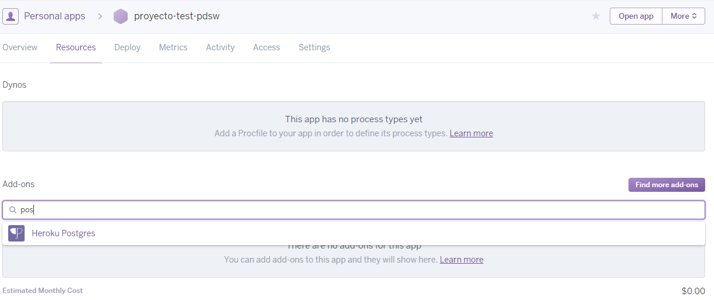
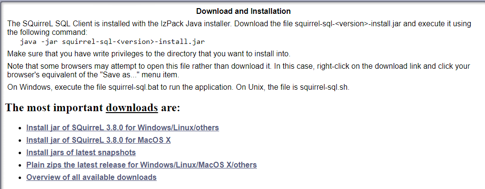
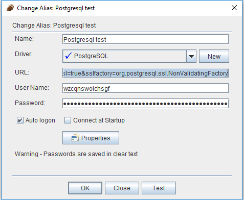

## Configuracion Base de datos en Heroku


1. Cree (si no la tiene aún) una cuenta en el proveedor PAAS Heroku ([www.heroku.com](www.heroku.com)).
2. Acceda a su cuenta en Heroku y cree una nueva aplicación:

	
	
	

3. Después de crear su cuenta en Heroku y la respectiva aplicación,Agregue un Add-ons,para esto diríjase a la pestaña "Resources" y en la parte inferior encontrara una pestaña de búsqueda,escriba "Heroku Postgres"

	
	
	Seleccione la opción "Heroku Postgres" , a continuación saldrá un recuadro donde se elegirá el plan a usar,por default esta seleccionado el plan gratuito:
	
	

4. Una vez creada la base de datos saldrá un mensaje de información diciendo que la base de datos fue agregada con éxito a la aplicación anteriormente creada.
	
	

5. Seleccione la opción que muestra la base de datos anteriormente creada

	 

	Una vez cargada la base de datos,se mostrara la información básica de la base de datos

	

	
	
6.	Revise la información de conexión de la base de datos anteriormente creada

	Vaya a la pestaña "Settings"
	
	
	
	Luego presione el botón "View Credentials"
	
	

7.	Se encontrara la siguiente información:
	```
	Host: Server donde esta alojada la base de datos
	```
	```
	DataBase: Nombre de la base de datos 
	```
	```
	User: Usuario que se usara para entrar en la base de datos
	```
	```
	Port: Puerto por default 
	```
	```
	Password: contraseña del usuario para entrar en la base de datos
	```
	


8.	Conectándose a la base de datos
	
	(1)Para conectarse a la base de datos es preferible utilizar un cliente,en este caso usaremos el cliente SQuirreL.
	(2)Diríjase a la pagina oficial de SQuirreL [http://www.squirrelsql.org/](http://www.squirrelsql.org/) y descargue el instalador
	
	
	
	
	(3)Una vez descargado el instalador diríjase a la ruta donde se encuentra el archivo, abra la consola y proceda a instalar el           programa con el siguiente comando:
	```
	java -jar squirrel-sql-<version>-install.jar
	```
	(4)En caso de que el instalador genere errores por que no tiene permisos de escritura en la ruta por default,seleccione otra 		tipo "Documentos"
	
	
	
	(5)Seleccione instalar todos los plugins
	
	
	
	(6)Seleccione crear un acceso directo a escritorio
	
	
	
	(7)Una vez instalado se procederá a descargar el ultimo plugin de Postgres,para esto diríjase al siguiente link y descargue la 	versión del plugin acorde a su versión de java.
	
	[https://jdbc.postgresql.org/download.html](https://jdbc.postgresql.org/download.html)
	
	(8)Una vez descargado el plugin cópielo y peguelo en la carpeta "plugins"  donde se instalo SQuirreL
	
	
	
	(9)Proceda a ejecutar el programa y diríjase a la pestaña "Drivers" y localice el driver "Postgres"
	
	
	
	(10)Dele click derecho y luego seleccione la opción de "modificar"
	
	
	
	(11)Se abrirá un recuadro con la configuración del plugin,deje la casilla Class Name como se observa en la siguiente imagen.
	
	
	
	(12)Ahora en la pestaña "Extra Class Path" agregue el plugin de Postgres anteriormente descargado y en la casilla Class Name déjela como muestra la imagen.
	
	
	
	(13)Guarde la configuración y podrá observar que el driver Postgres ya sale con un "chulito" de color azul.
	
	(14)Ahora diríjase a la pestaña Alias y agregue uno nuevo, llene los campos acorde a lo siguiente:
	
	```
	Name: Nombre de la conexión "puede ser cualquiera"
	```
	```
	Driver: Seleccione el driver a usar en este caso "PostgreSQL"
	```
	```
	URL: La URL de la base de datos, para esto usaremos los datos del paso 7:
	```
	```
	jdbc:postgresql://[Host del paso 7]:[Puerto del paso 7]/[Base de datos del paso 7]
	```
	```
	Su URL debe quedar como el siguiente ejemplo: 
	```
	```
	jdbc:postgresql://ec2-50-19-110-195.compute-1.amazonaws.com:5432/d6gl59md04gnl0
	```	
	Debido a que la versión gratuita de heroku no tiene configurado las credenciales SSL,es necesario informarle al SQuirreL 		(si no hacemos esto generara error al intentar conectarnos),para esto agregamos la siguiente información a la URL:
	```	
	?ssl=true&sslfactory=org.postgresql.ssl.NonValidatingFactory
	```	
	Por lo que la URL en definitiva quedaría de la siguiente manera:
	```	
	jdbc:postgresql://ec2-50-19-110-195.compute-1.amazonaws.com:5432/d6gl59md04gnl0?ssl=true&sslfactory=org.postgresql.ssl.NonValidatingFactory
	```
	```
	User: user del paso 7
	```
	```
	Password: contraseña del paso 7
	```
	
	
	(15)Una vez configurado presione el botón "Test",si fue correcta la conexión proceda a darle "ok",si no revise los parámetros nuevamente.
	
	
	
	(16)Parece arriba del alias anteriormente creado y dele doble click para conectarse a la base de datos.
	
	
	
	
9.	Configuración del contenedor liviano para Postgres

	(1)Agregue la siguiente dependencia (Postgres) a su proyecto.
	
	```
	<dependency>
            <groupId>org.postgresql</groupId>
            <artifactId>postgresql</artifactId>
            <version>42.0.0</version>
    </dependency>
	```

	(2)En el contenedor liviano ajuste el "JdbcHelper" para que use Postgres.
	
	
	
	(3)Ajuste los archivos de configuración de la aplicacion (applicationconfig-h2.properties y applicationconfig.properties)
	
	Para cada archivo agregue o reemplace la correspondiente configuración
	
	applicationconfig-h2.properties
	```
	dao=mybatis
	
	
	url=jdbc:h2:file:./target/db/testdb;MODE=PostgreSQL
	
	driver=org.postgresql.Driver
	
	driver.encoding=UTF8
	
	user=anonymous
	
	pwd=""
	
	
	config=mybatis-config-h2.xml
	```
	
	applicationconfig.properties
	```
	dao=mybatis

	url=[URL definitiva del punto 8]
	
	driver=org.postgresql.Driver
	
	driver.encoding=UTF8
	
	user=[User del punto 8 o del punto 7]
	
	pwd=[Contraseña del punto 8 o del punto 7]
	
	config=mybatis-config.xml

	```
	(4)Ajuste de los archivos de configuración de mybayis(mybatis-config-h2.xml y mybatis-config.xml)
	
	Para cada archivo agregue o reemplace la correspondiente configuración
	
	mybatis-config-h2.xml
	```
	<environments default="development">
        <environment id="development">
            <transactionManager type="JDBC" />
            <dataSource type="POOLED">
                <property name="driver" value="org.h2.Driver" />
                <property name="url" value="jdbc:h2:file:./target/db/testdb;MODE=PostgreSQL" />
                <property name="username" value="anonymous" />
                <property name="password" value="" />
            </dataSource>
        </environment>
    </environments>
	```
	
	mybatis-config.xml
	```
	<environments default="development">
        <environment id="development">
            <transactionManager type="JDBC" />
            <dataSource type="POOLED">
                <property name="driver" value="org.postgresql.Driver" />
                <property name="url" value="[URL definitiva del punto 8]"/> 
                <property name="username" value="[User del punto 8 o del punto 7]" />
                <property name="password" value="[Contraseña del punto 8 o del punto 7]" />
            </dataSource>
        </environment>
    </environments>
	```